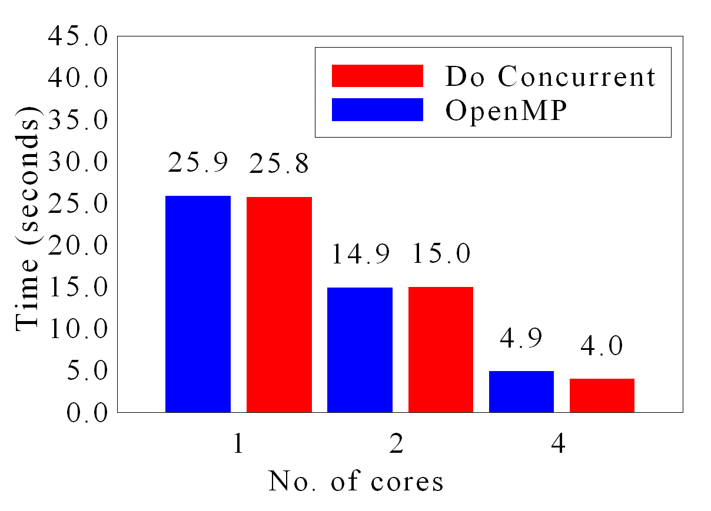
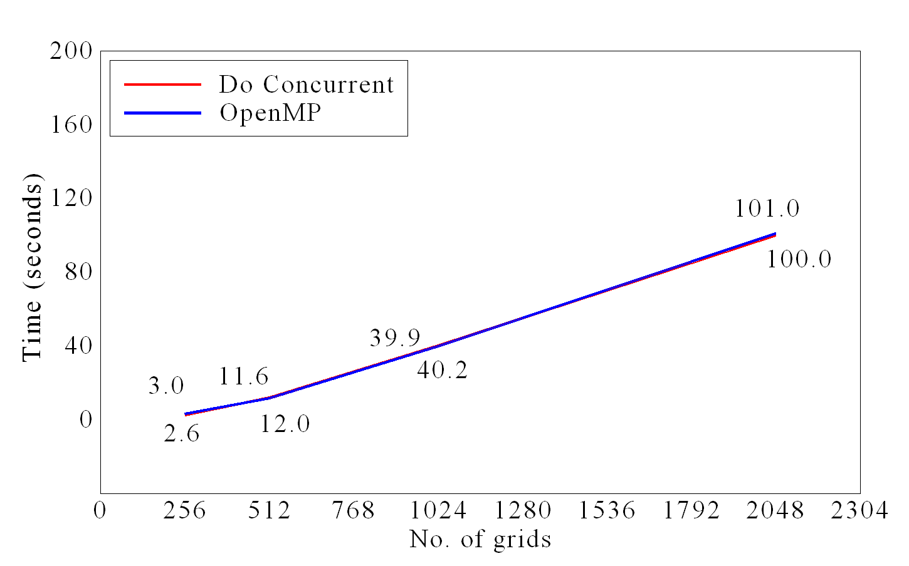

# **AMSimulator**

<div style="text-align: center;">


</div>

AMSimulator is an application of the phase field method for the additive manufacturing simulation. The example app is developed for the high Performance Fortran implementation with standard language parallelism. For details please see the work. 

[High Performance Additive Manufacturing Phase Field Simulation: Fortran Do Concurrent vs OpenMP](https://www.sciencedirect.com/science/article/pii/S0927025625001314)


# **dependencies**

* [Fortran compiler (e.g. Intel, NVIDIA)](https://github.com/Shahid718/Installation_guide)
* [Dislin graphical library](https://github.com/Shahid718/Installation_guide)

# **directory structure**

The structure of the repository is
```
AMSimulator
├── languages
├── legacyToModernFortran
├── plotting
└── simulator
```

## languages
This folder shows the code in the selected languages. The structure of the repository is
```
languages
├── Fortran
├── C
├── C++
├── matlab
└── python
```

## legacyToModernFortran
This folder shows the use of Fortran standard to write the code in serial and parallel.

```
legacyToModernFortran
├── FORTRAN77
├── Fortran90
├── Fortran2008
└── OpenMP
```

## simulator
The folder contains the simulator. 

## plotting

The plotting directory shows the use of dislin graphical library to plot bar charts and line graphs. The example code looks like






## **Note:**

The Fortran codes are tested with the intel compiler (ifort) on Windows 10.

## **Date**
 February 25, 2025